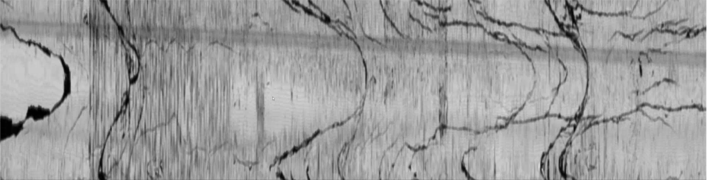
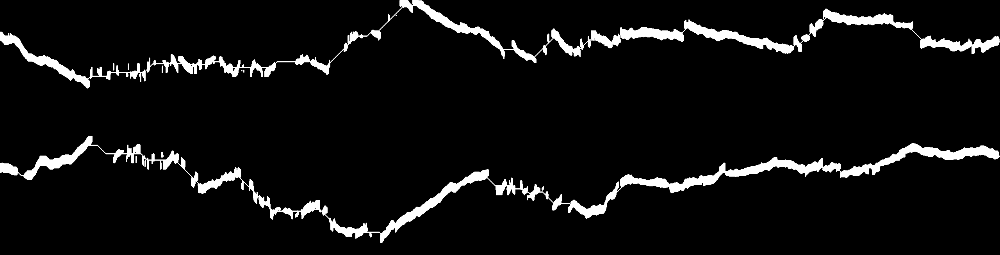
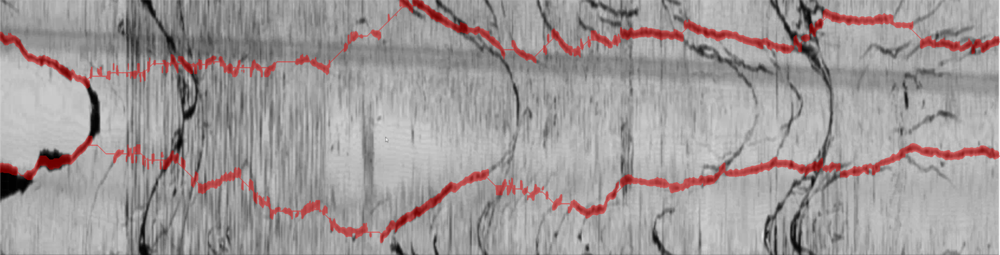
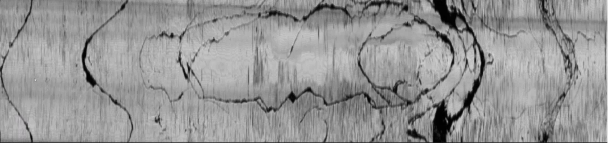
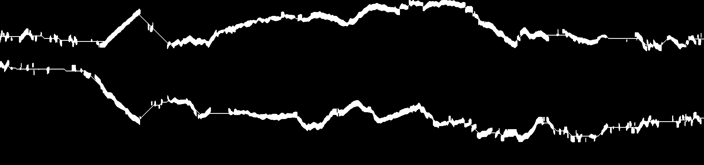
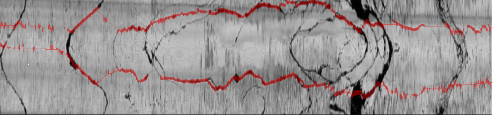
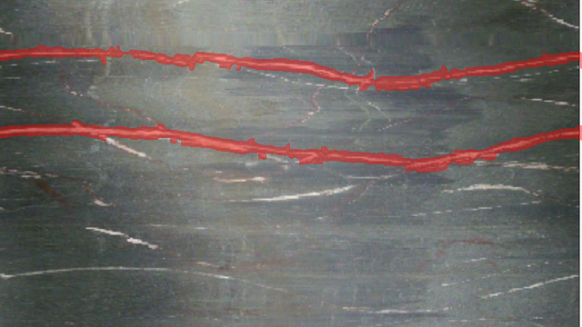
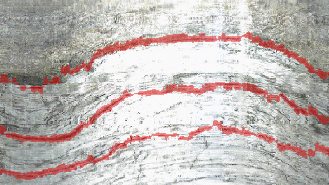
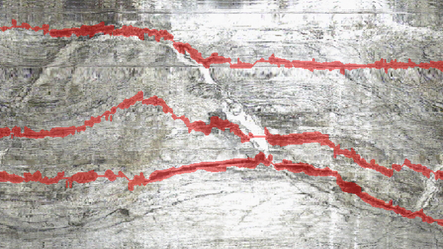

# Wellbore Fracture Segmentation

<p align="center">
  Classical image processing for detecting candidate primary structural fractures in unwrapped wellbore images.
</p>

<p align="center">
  <a href="https://colab.research.google.com/github/KimiaVanaei/wellbore-fracture-segmentation/blob/main/wellbore_fracture_segmentation.ipynb">
    
  </a>
  
  
  
</p>

---

## Overview

This repository contains a **training-free classical image-processing pipeline** for isolating candidate **primary fractures** from unwrapped wellbore images.

The main challenge is to distinguish dominant structural fractures from:

- thin secondary and micro-cracks,
- textured rock background,
- illumination variation,
- noise,
- vertical acquisition artifacts.

Instead of relying on a single threshold or connected-component rule, the method combines **multiscale morphological ridge enhancement**, **Sobel-based orientation information**, and **dynamic-programming continuity tracking**. A candidate fracture is accepted only when it forms a sufficiently strong and smooth path across the image width.

The final output for each image consists of:

- a binary primary-fracture mask,
- a red fracture overlay,
- diagnostic intermediate stages shown inside the notebook.

---

## Results

### Graded image — `Well1.jpg`

<table>
  <tr>
    <th width="33%">Input</th>
    <th width="33%">Binary Mask</th>
    <th width="33%">Overlay</th>
  </tr>
  <tr>
    <td></td>
    <td></td>
    <td></td>
  </tr>
</table>

### Graded image — `well2.png`

<table>
  <tr>
    <th width="33%">Input</th>
    <th width="33%">Binary Mask</th>
    <th width="33%">Overlay</th>
  </tr>
  <tr>
    <td></td>
    <td></td>
    <td></td>
  </tr>
</table>

### Validation examples

The same pipeline is applied to all validation images without image-specific parameter changes.

| `0153.png` | `0176.png` | `0185.png` |
|:---:|:---:|:---:|
|  |  |  |

---

## Processing Pipeline


### 1. Preprocessing

Each image is converted to grayscale and normalized using the 1st and 99th intensity percentiles. The normalized image is then processed using:

- a `3 × 3` median filter,
- CLAHE with moderate local contrast enhancement,
- a `5 × 5` Gaussian blur.

The enhancement is intentionally conservative so that fine texture is not amplified into false fracture evidence.

### 2. Multiscale ridge enhancement

Dark and bright structures are processed independently:

- **black-hat morphology** highlights dark ridges,
- **white top-hat morphology** highlights bright ridges.

Three resolution-dependent elliptical structuring elements are used to capture fracture structures at different apparent thicknesses.

A small grayscale morphological opening then suppresses narrow responses more strongly than thick responses. The original and opened ridge responses are combined so that weak but continuous sections of a primary fracture are preserved.

Column-wise normalization reduces the influence of vertical acquisition artifacts.

### 3. Orientation-aware evidence

Sobel derivatives are used to estimate local gradient orientation.

Horizontal and oblique ridge structures are favored, while nearly vertical striping receives less weight. The resulting response is smoothed before path tracking.

For ridge response $R(y,x)$, the normalized evidence is conceptually

$$
S(y,x)=
\text{clip}
\left(
\frac{
R(y,x)-\text{median}_y R(y,x)
}{
P_{95,y}(R(y,x))-\text{median}_y R(y,x)+\epsilon
},
0,3
\right)
$$

### 4. Full-width continuity tracking

Rather than selecting connected components, the algorithm explicitly searches for smooth left-to-right paths using dynamic programming.

At each new image column, the path may:

- move one pixel upward,
- stay on the same row,
- move one pixel downward.

The dynamic-programming state also keeps the previous vertical step, allowing both vertical movement and sudden changes in slope to be penalized:

$$
D_s(y,x)=E(y,x)+
\max_{s'\in\{-1,0,1\}}
\left[
D_{s'}(y-s,x-1)
-\lambda_1|s|
-\lambda_2|s-s'|
\right]
$$

After a path is extracted, a narrow band around it is suppressed before searching for another distinct candidate.

A path is retained only when it satisfies conditions based on:

- average dynamic-programming score,
- fraction of locally supported columns,
- maximum unsupported interval.

Dark and bright candidates are evaluated separately, and the stronger supported polarity is selected automatically for each image.

### 5. Local fracture-thickness reconstruction

The tracked path represents only a fracture **centerline**. The visible fracture thickness is reconstructed locally rather than by applying a fixed-width dilation.

For each retained path:

1. A narrow vertical neighborhood is examined around the centerline.
2. Ridge response is thresholded using both global and local percentiles.
3. Consecutive supported pixels are grouped into vertical runs.
4. The run nearest the centerline is retained.
5. The centerline is preserved through short weak-contrast regions.
6. Small closing and dilation operations produce a compact final mask.

Restricting reconstruction to a verified path helps prevent unrelated micro-cracks elsewhere in the image from entering the segmentation.

---

## Included Data

The repository contains **10 wellbore images**:

- **2 graded images**
  - `Well1.jpg`
  - `well2.png`
- **8 validation images**
  - `0153.png`
  - `0170.png`
  - `0176.png`
  - `0179.png`
  - `0185.png`
  - `0188.png`
  - `0190.png`
  - `0197.png`

The graded images have higher resolution, while the validation images are smaller. Spatial parameters such as morphological kernel sizes, suppression radius, and reconstruction search radius are scaled according to image dimensions so that the same functions can be applied to both groups.

---

## Repository Structure

```text
wellbore-fracture-segmentation/
│
├── data/
│   ├── graded/
│   │   ├── Well1.jpg
│   │   └── well2.png
│   │
│   └── validation/
│       ├── 0153.png
│       ├── 0170.png
│       ├── 0176.png
│       ├── 0179.png
│       ├── 0185.png
│       ├── 0188.png
│       ├── 0190.png
│       └── 0197.png
│
├── outputs/
│   ├── Well1_primary_mask.png
│   ├── Well1_primary_overlay.png
│   ├── well2_primary_mask.png
│   ├── well2_primary_overlay.png
│   ├── 0153_primary_mask.png
│   ├── 0153_primary_overlay.png
│   └── ...
│
├── wellbore_fracture_segmentation.ipynb
├── requirements.txt
└── README.md
```

Each input image produces two files:

```text
<image_name>_primary_mask.png
<image_name>_primary_overlay.png
```

The notebook also creates an `outputs.zip` archive containing all generated masks and overlays.

---

## Results from the Included Run

The executed notebook automatically selected the following ridge polarities and numbers of retained paths:

| Image | Selected polarity | Retained paths | Path support |
|---|:---:|:---:|---|
| `Well1.jpg` | Dark | 2 | 0.76, 0.80 |
| `well2.png` | Dark | 2 | 0.75, 0.71 |
| `0153.png` | Bright | 2 | 1.00, 0.96 |
| `0170.png` | Bright | 1 | 1.00 |
| `0176.png` | Dark | 3 | 0.95, 0.89, 0.92 |
| `0179.png` | Dark | 2 | 1.00, 0.95 |
| `0185.png` | Dark | 3 | 0.88, 0.87, 0.91 |
| `0188.png` | Dark | 1 | 0.87 |
| `0190.png` | Dark | 2 | 0.87, 0.92 |
| `0197.png` | Dark | 2 | 0.96, 0.88 |

The number of paths is determined from the measured ridge evidence and continuity criteria.

---

## Running the Notebook

### Google Colab

The notebook is configured for Google Colab and can be opened directly from GitHub:

[](https://colab.research.google.com/github/KimiaVanaei/wellbore-fracture-segmentation/blob/main/wellbore_fracture_segmentation.ipynb)

The setup cell performs a sparse clone of the repository and retrieves the required `data/` directory and `requirements.txt`. Dependencies are then installed automatically.

Run the notebook cells from top to bottom.

### Local execution

Clone the repository:

```bash
git clone https://github.com/KimiaVanaei/wellbore-fracture-segmentation.git
cd wellbore-fracture-segmentation
pip install -r requirements.txt
```

Then open:

```bash
jupyter notebook wellbore_fracture_segmentation.ipynb
```

> **Note:** the current setup cell uses the Colab path `/content/wellbore-fracture-segmentation`. For local execution, set `REPO_DIR` to your local repository directory and skip the Colab-specific clone commands.

---

## Dependencies

The implementation uses:

- Python
- NumPy
- SciPy
- OpenCV
- Matplotlib
- Jupyter / Google Colab

Exact installation requirements are provided in `requirements.txt`.

---

## Evaluation and Limitations

No manually annotated ground-truth fracture masks are provided with the dataset. Therefore, quantitative segmentation metrics such as:

- Dice score,
- IoU,
- precision,
- recall,
- pixel accuracy

cannot be reported reliably.

The generated masks should therefore be interpreted as **candidate primary-fracture segmentations**, not verified geological annotations.

They are selected according to the image-processing criteria implemented in this project:

- relatively strong ridge evidence,
- morphological thickness,
- smooth full-width continuity.

Expert validation would be required before treating the generated masks as geological ground truth.

---

## Author

**Kimia Vanaei**

GitHub: [@KimiaVanaei](https://github.com/KimiaVanaei)
